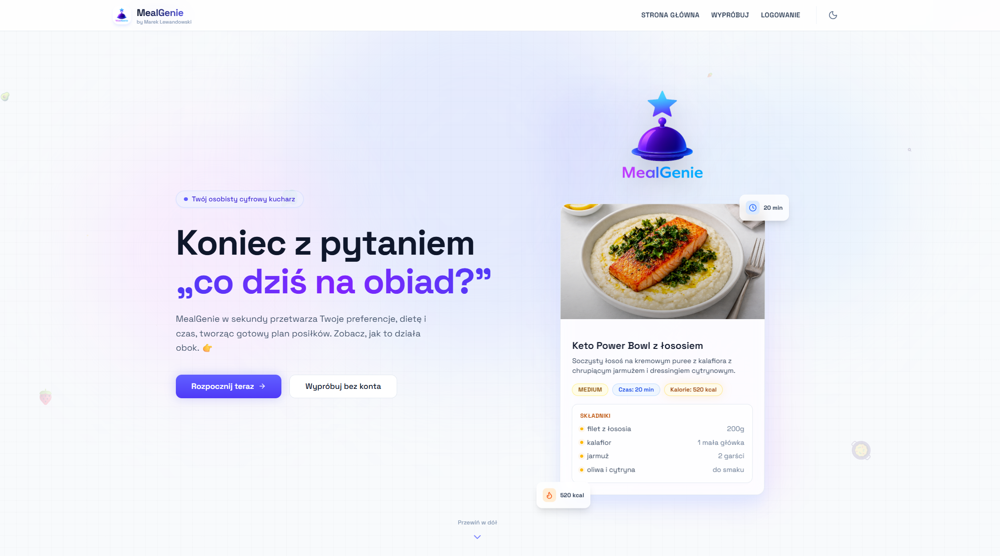
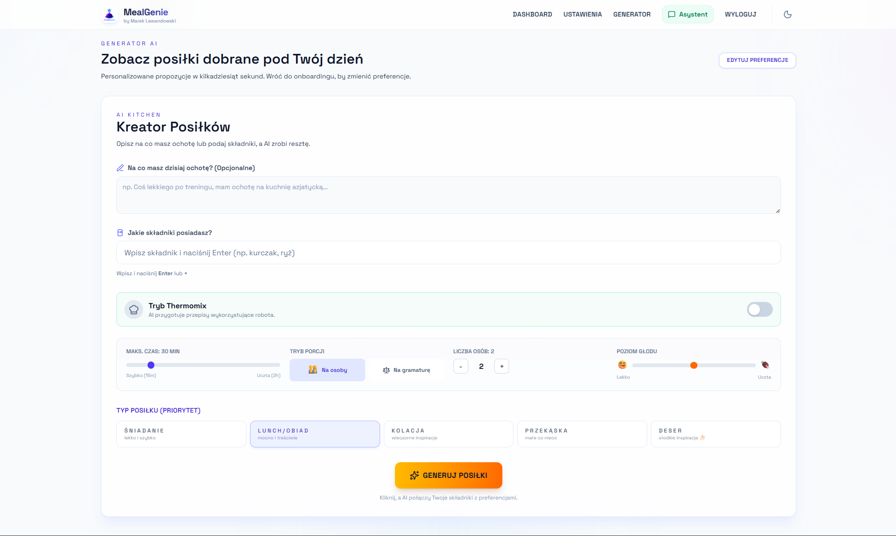
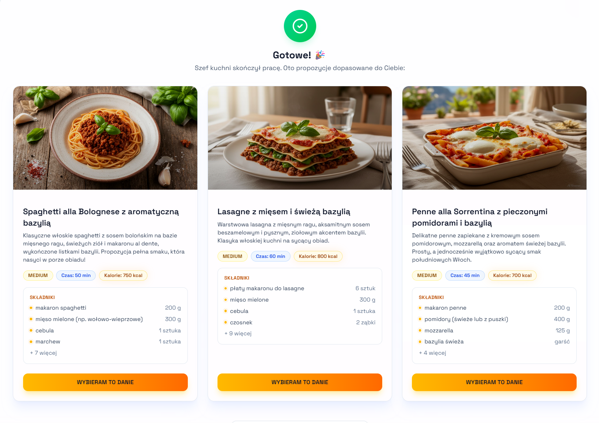
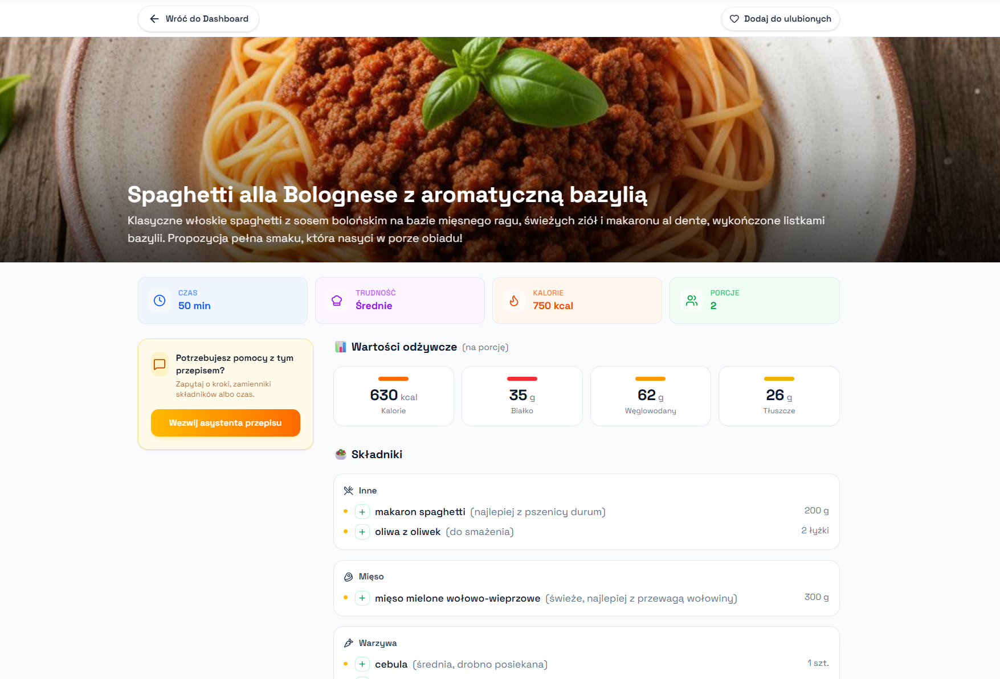
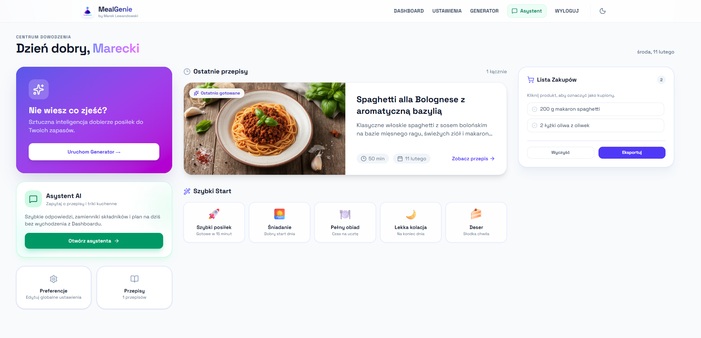
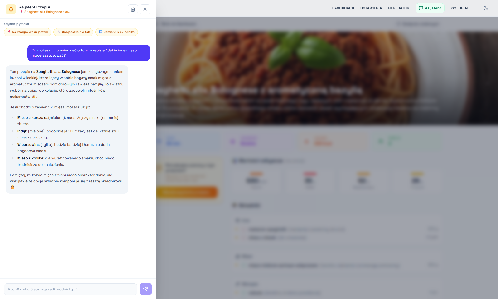

# MealGenie

Inteligentny asystent kulinarny napędzany AI. Generuje spersonalizowane propozycje posiłków, kompletne przepisy z wartościami odżywczymi i fotorealistyczne zdjęcia dań na podstawie Twojego profilu żywieniowego, umiejętności i tego, co masz w lodówce.

Cała aplikacja w języku polskim, zaprojektowana z myślą o polskim rynku (składniki dostępne w popularnych sieciach sklepów).

---

## Live Demo

**[mealgenie.pro](https://mealgenie.pro)**

---

## Screenshots

Strona powitalna komunikująca wartość produktu. Animowany hero, sekcja problemów kulinarnych i CTA do rejestracji.

Serce aplikacji: wybór typu posiłku, suwak czasu, poziom głodu, tryb porcji/gramaturowy, toggle Thermomix, pole promptu tekstowego i lista dostępnych składników.

Spersonalizowane propozycje z obrazami wygenerowanymi przez FLUX.2, nazwą dania, kluczowymi składnikami i czasem przygotowania.

Kompletny przepis: kalorie, białko, tłuszcz, węglowodany, lista składników z gramaturą, kroki w Markdown, przycisk do czatu z asystentem AI.

Panel użytkownika: historia wygenerowanych posiłków, ulubione przepisy, skróty szybkiego startu i dostęp do ustawień preferencji.

Asystent AI dla przepisu. Zna przepis od podszewki, może odpowiadać na pytania, sugerować modyfikacje składników i udzielać porad kulinarnych w kontekście wybranego dania.

---

## Key Features

**Generowanie posiłków** - AI tworzy 3 spersonalizowane propozycje dań na podstawie profilu użytkownika, dostępnych składników, typu posiłku, czasu przygotowania i poziomu głodu.

**Pełne przepisy z makro** - po wyborze propozycji system generuje kompletny przepis z dokładnymi krokami, listą składników z gramaturą oraz wartościami odżywczymi.

**Fotorealistyczne obrazy dań** - każda propozycja otrzymuje obraz wygenerowany przez model FLUX.2-dev na podstawie opisu dania i składników.

**Tryb Thermomix** - dedykowany tryb generujący przepisy z konkretnymi ustawieniami Thermomixa (czas, temperatura, obroty), z pragmatycznym podejściem (gdzie patelnia jest lepsza, AI to powie).

**Tryb gramaturowy** - zamiast liczby porcji podajesz docelową wagę gotowego produktu (np. 500g ciasta). Przydatne w cukiernictwie i meal prepie.

**Asystent czatowy** - wbudowany chatbot do pytań o przepis, modyfikacji składników lub porad kulinarnych w kontekście wybranego dania.

**Profil preferencji** - onboarding zbierający dane o diecie, alergiach, nielubianych składnikach, ulubionych kuchniach, umiejętnościach, sprzęcie kuchennym, budżecie i poziomie ostrości.

**Historia i ulubione** - pełna historia wygenerowanych posiłków z możliwością oznaczania ulubionych, filtrowania i powrotu do zapisanych przepisów.

**Dark mode** - pełna obsługa ciemnego motywu w całej aplikacji.

---

## Tech Stack

### Frontend

React 19, Vite 7, TypeScript 5.9, Tailwind CSS 4, Zustand (stan globalny), TanStack Query (cache danych serwerowych), React Router 7, Framer Motion (animacje), React Hook Form + Zod (walidacja formularzy), react-markdown (renderowanie przepisów), Axios.

### Backend

Node.js 20, Express 5, TypeScript 5.9, Prisma 5 (ORM + migracje), PostgreSQL 16, Zod (walidacja schematów i Structured Outputs), bcryptjs (hashowanie haseł), jsonwebtoken (autoryzacja JWT).

### Zewnętrzne API

- **OpenAI GPT-4.1** -- generowanie propozycji posiłków i pełnych przepisów (Structured Outputs z Zod)
- **OpenAI GPT-4o** -- asystent czatowy w kontekście przepisu
- **Together AI FLUX.2-dev** -- generowanie fotorealistycznych obrazów dań

## Deployment

Aplikacja działa jako cztery kontenery Docker Compose na serwerze VPS z Ubuntu 24.04:

- **db** - PostgreSQL 16 (Alpine) z healthcheckiem
- **backend** - Node.js 20 (Alpine), multi-stage build, Prisma migrate deploy przy starcie
- **frontend** - nginx (Alpine), serwuje zbudowane SPA z fallbackiem dla React Router
- **caddy** - Caddy 2 (Alpine), reverse proxy z automatycznym SSL